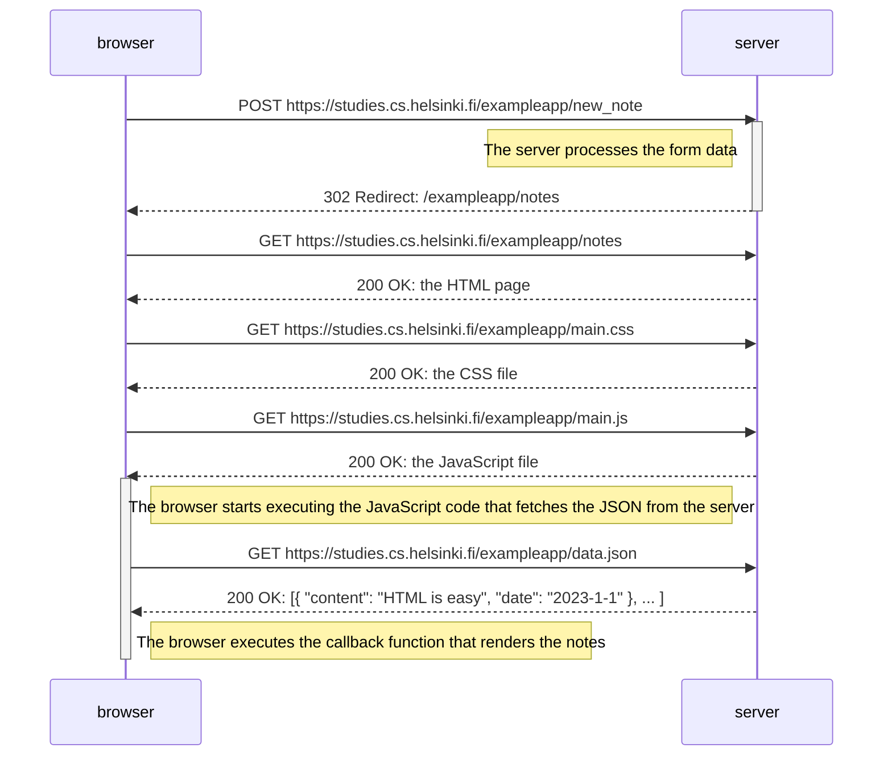

# user creates a new note (non-SPA version)

```mermaid
sequenceDiagram
    participant browser
    participant server
    
    browser->>server: POST https://studies.cs.helsinki.fi/exampleapp/new_note
    activate server
    note left of server: The server processes the form data
    server-->>browser: 302 Redirect: /exampleapp/notes
    deactivate server

    browser->>server: GET https://studies.cs.helsinki.fi/exampleapp/notes
    server-->>browser: 200 OK: the HTML page
    
    browser->>server: GET https://studies.cs.helsinki.fi/exampleapp/main.css
    server-->>browser: 200 OK: the CSS file
    
    browser->>server: GET https://studies.cs.helsinki.fi/exampleapp/main.js
    server-->>browser: 200 OK: the JavaScript file
    
    activate browser
    Note right of browser: The browser starts executing the JavaScript code that fetches the JSON from the server
    browser->>server: GET https://studies.cs.helsinki.fi/exampleapp/data.json
    server-->>browser: 200 OK: [{ "content": "HTML is easy", "date": "2023-1-1" }, ... ]
    Note right of browser: The browser executes the callback function that renders the notes
    deactivate browser    
```