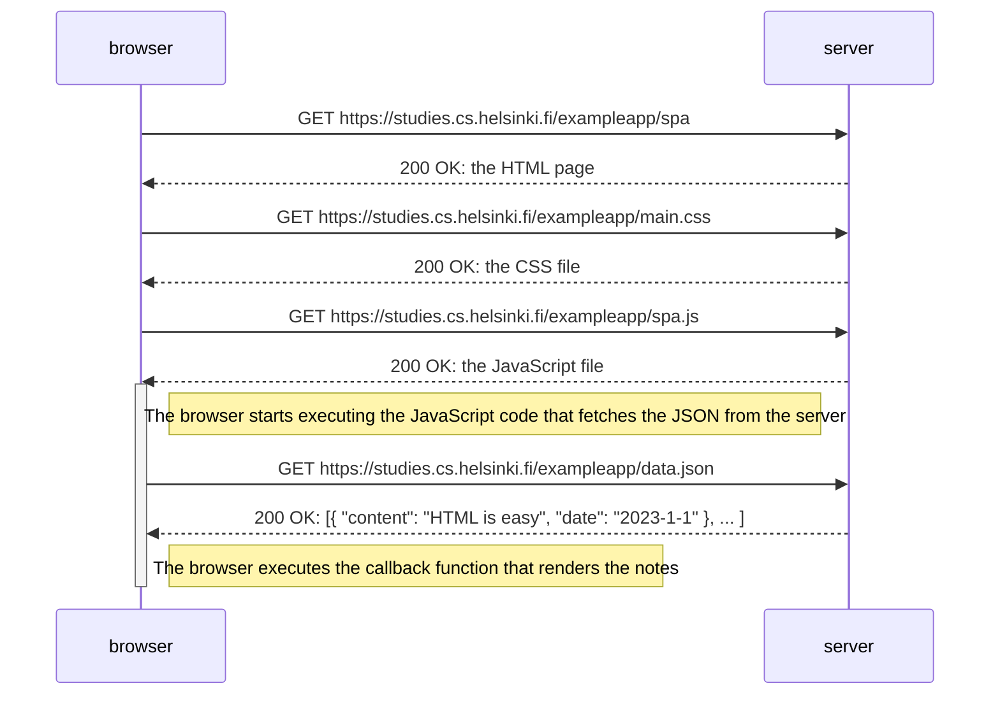

# user enters the app (SPA version)

```mermaid
sequenceDiagram
    participant browser
    participant server

    browser->>server: GET https://studies.cs.helsinki.fi/exampleapp/spa
    server-->>browser: 200 OK: the HTML page

    browser->>server: GET https://studies.cs.helsinki.fi/exampleapp/main.css
    server-->>browser: 200 OK: the CSS file
    
    browser->>server: GET https://studies.cs.helsinki.fi/exampleapp/spa.js
    server-->>browser: 200 OK: the JavaScript file

    activate browser
    Note right of browser: The browser starts executing the JavaScript code that fetches the JSON from the server
    browser->>server: GET https://studies.cs.helsinki.fi/exampleapp/data.json
    server-->>browser: 200 OK: [{ "content": "HTML is easy", "date": "2023-1-1" }, ... ]
    Note right of browser: The browser executes the callback function that renders the notes
    deactivate browser    
```