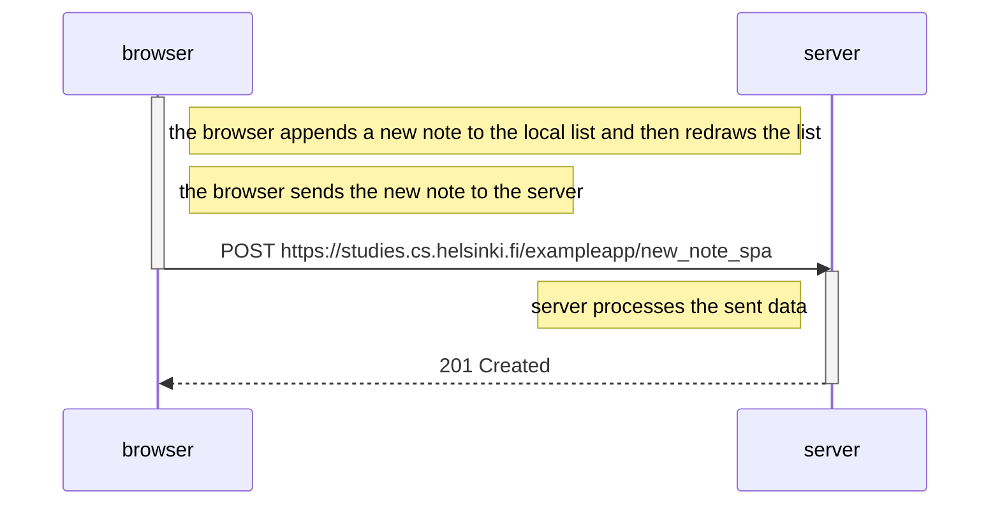

# user creates a new note (SPA version)

```mermaid
sequenceDiagram
    participant browser
    participant server

    activate browser
    note right of browser: the browser appends a new note to the local list and then redraws the list
    note right of browser: the browser sends the new note to the server
    browser->>server: POST https://studies.cs.helsinki.fi/exampleapp/new_note_spa
    deactivate browser
    activate server
    note left of server: server processes the sent data
    server-->>browser: 201 Created
    deactivate server
```